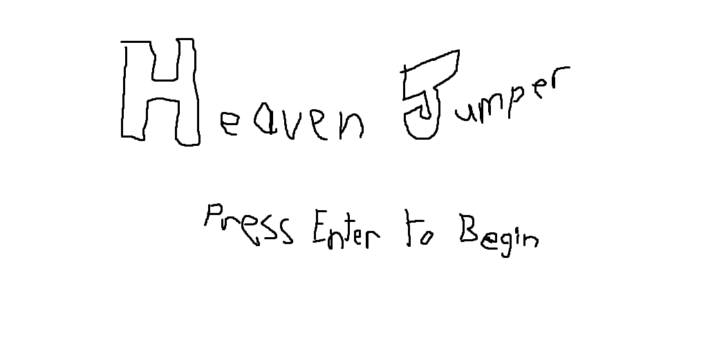
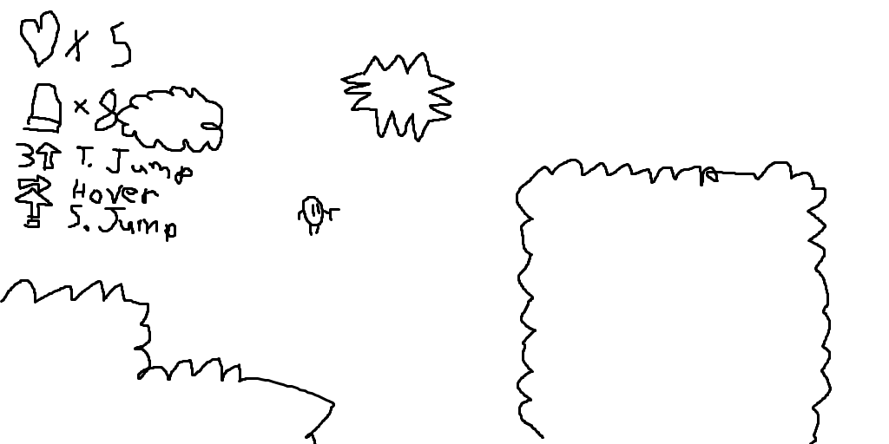
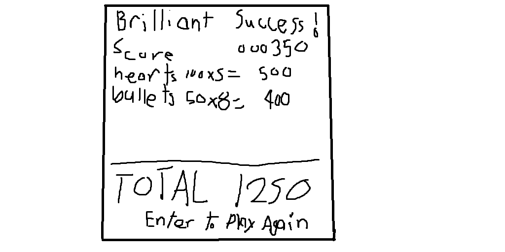
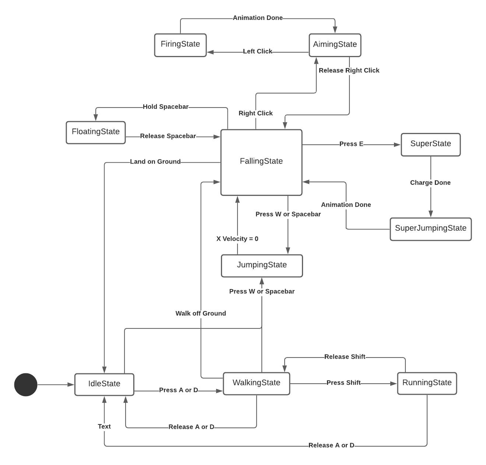
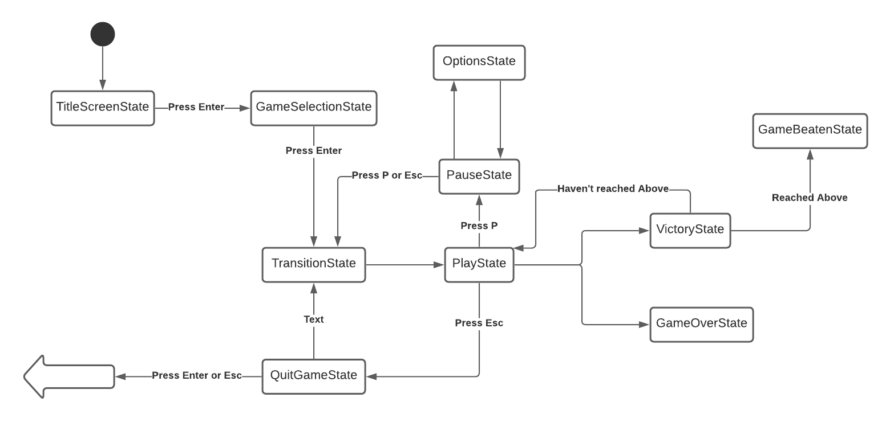
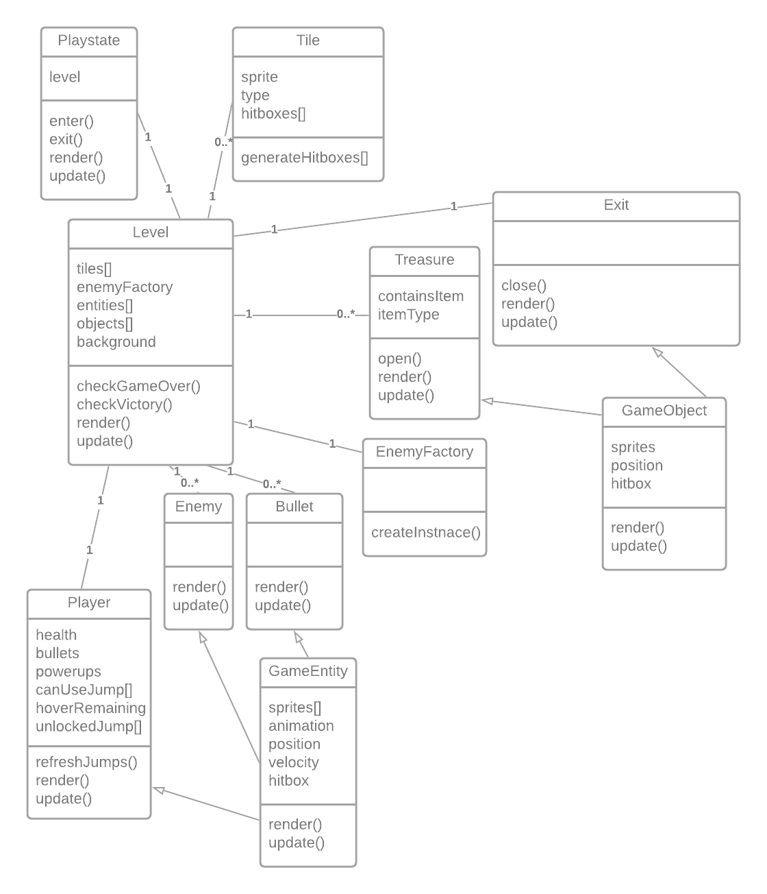

# Game Programming F21 Project - Heaven Jumper

## ✒️ Description

You wake up in a heavenly field of clouds. You know not of what to do, but detect small signs of something... beautiful above. As you move a bit closer, the signs get more and more apparent. You know that you must climb to reach whatever this may be.

## 🕹️ Gameplay

In this platform-adventure journey, you collect resources and navigate randomly generated levels with multiple jumps.

You begin with a simple jump and double-jump. Collecting power-ups will allow you to use more kinds of jumps, including a triple jump, a hover, and a super jump.

You also have a gun that you can use to shoot enemies and propel yourself to greater heights. Bullets are a limited resource, however, so pick wisely.

Touching hazards or enemies will make you lose a heart. You start with three hearts. There is no maximum health, so you can collect as many hearts as you can find. If you lose all of your hearts, you lose.

## 📃 Requirements

1. The user can move to the left or right using A or D respectivley.
2. The user can make the character run by pressing A or D while SHIFT is held. This increases the character's ground speed and changes the walking animation to the running animation.
3. The user can make the character jump by pressing W or SPACE while on the ground. This sets the character's Y velocity so that they travel a small distance upward.
4. The user can make the character double jump by pressing W or SPACE while in mid-air. This sets the character's Y velocity similar to the jump. This can only be used once until the character touches the floor again.
5. The user can make the character triple jump by pressing W or SPACE while in mid-air. This sets the character's Y velocity similar to the jump. This can only be used once until the character touches the floor again.
6. The character cannot use the triple jump until they pick up the appropriate powerup.
7. The user can make the character hover by holding W or SPACE while in mid-air. Trying to hover should not use up or trigger the double or triple jumps. The character's Y velocity is 0 throughout the length of the hover. The user should be able to hover for up to 1 second before it ends automatically. The player cannot hover again until they touch the ground.
8. The character can hover multiple times in the air until the total amount of time hovered exceeds a certain amount of time.
9. The character cannot use the hover until they pick up the appropriate powerup.
10. The user can make the character super jump by pressing E. This will make the character enter a charging state, where their X and Y velocities are stuck at 0. When they have charged for a certain amount of time, their Y velocity will be set to a large value, giving them a significant boost in height. All controls are disabled until the character reaches the peak of their height. This cannot be used again until they touch the ground.
11. The character cannot use the super jump until they pick up the appropriate powerup.
12. The user can press left click to make the character shoot a bullet in the direction they are facing. This bullet adds force to the character in the opposite direction of the bullet (recoil). Shooting a bullet will const the player... one bullet. They cannot shoot if they have zero bullets.
13. The user can hold right click to enter aim mode. The player will point their gun in the direction of the mouse cursor. Left Clicking in this state will make the character shoot a bullet at the mouse cursor, with recoil being applied to the player in the opposite direction from the bullet as before. When the character releases the right mouse button, the character stops aiming.
14. The level should have several pre-rendered "rooms" (x by y areas of preset level chunks) that are randomly shuffled, giving different level layouts.
15. Powerups (which grant different kinds of jumps), hearts, and bullets are scattered around the level in chests. When the character touches a chest, it opens, revealing what's inside and giving it to the character.
16. Powerups must be placed in a way that the player can collect them (do not put the Super Jump at the top of a tower that can only be climbed with a super jump)
17. Platforms are solid and cannot be passed through. If a player collides into a wall, their X velocity is set to 0. If they collide into a ceiling or floor, their Y velocity is set to zero. They also enter idle state when they touch the floor.
18. If a player collides into spikes, they lose a heart and are brought back to the last floor that they were standing on.
19. Enemies will move back and forth on their platform. They will turn around if they come to a platform's ledge, or if they come to a set of spikes.
20. If the player shoots an enemy, it dies. It will play a dying animation before disappearing. The enemy's hitbox dissapears when its dying animation begins.
20. If a player has no more hearts, the game will end and they will see a Game Over screen.
21. There is a UI that shows:
- How many hearts the character has.
- How many bullets the character has.
- A list showing each of the powerups, and wether or not you can use them.
- The player's score
22. Points will be awarded to the player for various actions:
- collecting power-ups
- opening chests
- killing enemies
- end-of-level bonuses
  - hearts remaining
  - bullets remaining
  - all enemies killed bonus
  - all treasure chests opened bonus
22. One of the rooms at the top will have an exit. When the character reaches the exit, the player earns point bonuses based on what they've done
23. Pressing P at any time will pause the game, freezing everything and putting the word "Paused" in the middle of the screen.
24. High Scores will be saved and persist across multiple play sessions
25. Options will be saved and persist across multiple play sessions

## Wireframes

Main Menu:

Gameplay:

Game Over Screen:

Victory/Score Screen:

## 🤖 State Diagrams

### Player State Diagram

### Game State Diagram

## 🗺️ Class Diagram

## 🎨 Assets

Sprites for the character, level, background, enemies, items, UI, and basically everything will be made by the both of us (Phil and Sean).

## 🔊 Sounds

All sounds will be taken from [freesound.org](https://freesound.org)